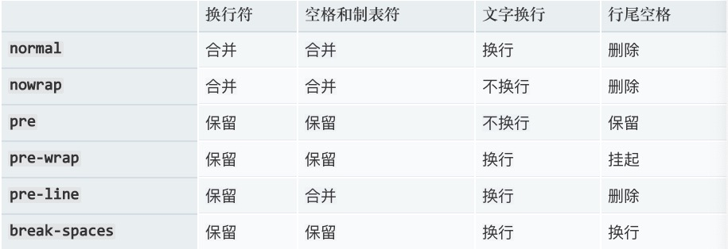

**white-space: ** 设置如何处理元素中的空白

**可选值:** 

- **nomal** 合并连续的空白符，把换行符转换成空白符
- **nowrap** 合并连续的空白符，忽略任何换行的符号
- **pre** 保留连续的空白符，只有遇到换行符和\<br\>元素才会换行
- **pre-wrap** 保留连续的空白符，遇到换行符和\<br\>元素会换行，触碰盒子的边界也会换行
- **pre-line** 合并连续的空白符，遇到换行符和\<br\>元素会换行，触碰盒子的边界也会换行

